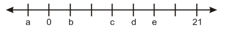
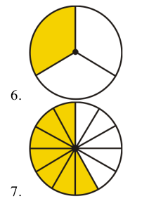
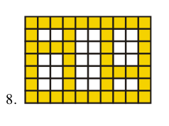
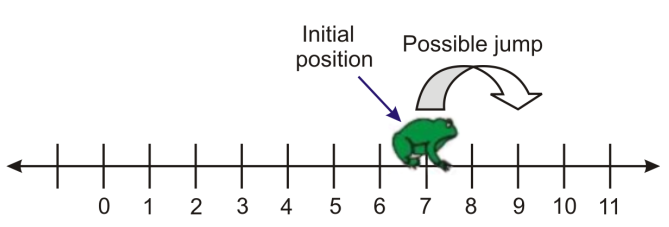

<html xmlns="http://www.w3.org/1999/xhtml" lang="en"><head>
<meta http-equiv="content-type" content="text/html; charset=UTF-8">
        <meta charset="UTF-8">
        <meta name="viewport" content="width=device-width, initial-scale=1.0">
    </head>
    <body>
        

            <h2>Numbers and Their Opposites</h2>
            
Every number has an opposite, which represents the same distance from zero but in the other direction.

            
        

        

            
A special situation arises when adding a number to its opposite. The sum is zero. This is summarized in the following
                property.
                The Additive Inverse Property: For any real number a, a + −a = 0.

        

        

            <h2>Absolute Value</h2>
            

                Absolute value represents the distance from zero when graphed on a number line. For example, the number 7 is
                7 units away from zero. The number -7 is also 7 units away from zero. Therefore, the absolute value of 7 and the
                absolute value of -7 are both 7.
                We write the absolute value of -7 like this: |−7|.
                We read the expression |x| like this: “the absolute value of x.”
                • Treat absolute value expressions like parentheses. If there is an operation inside the absolute value symbols
                evaluate that operation first.
                • The absolute value of a number or an expression is always positive or zero. It cannot be negative. With
                absolute value, we are only interested in how far a number is from zero, not the direction.
                Example 5: Evaluate the following absolute value expressions.

        

        

            <h2>Practice Set: Integers and Rational Numbers</h2>
            

                Sample explanations for some of the practice exercises 
below are available by viewing the following video. Note
                that there is not always a match between the number of 
the practice exercise in the video and the number of the
                practice exercise listed in the following exercise set. 
However, the practice exercise is the same in both. Integersand
                Rational Numbers

        

        

            
 1. Define absolute value.

            
 2. What are the two types of fractions?

            
 3. Give an example of a real number that is not an integer.

            
 4. What standards separate a rational number from an irrational number?

            
 5. The tick-marks on the number line represent evenly spaced integers. Find the values of a, b, c, d and e.

        

        

            
        
   
        

            
In 6 – 8, determine what fraction of the whole each shaded region represents.

        

        

            
        

        

            
        

        

            
In 9 – 12, place the following sets of rational numbers in order from least to greatest.

        

        

            
In 13 – 18, find the simplest form of the following rational numbers.

        

        

            
In 19 – 27, simplify.

        

        

            
In 28 – 33, compare the two real numbers using the symbol <or>.</or>

        

        

            
32. A frog is sitting perfectly on top of number 7 on a 
number line. The frog jumps randomly to the left or right,
                but always jumps a distance of exactly 2. Describe the 
set of numbers that the frog may land on, and list all the
                possibilities for the frog’s position after exactly 5 
jumps.

        

        

            
        

        

            
33. Will a real number always have an additive inverse? Explain your reasoning.

        

</body></html>