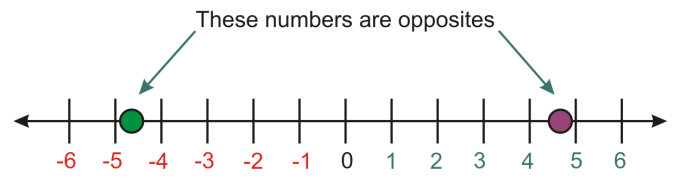

<html xmlns="http://www.w3.org/1999/xhtml" lang="en"><head>
<meta http-equiv="content-type" content="text/html; charset=UTF-8">
        <meta charset="UTF-8">
        <meta name="viewport" content="width=device-width, initial-scale=1.0">
    </head>
    <body>
        

            <h2>Numbers and Their Opposites</h2>
            
Every number has an opposite, which represents the same distance from zero but in the other direction.

            
        

        

            
A special situation arises when adding a number to its opposite. The sum is zero. This is summarized in the following
                property.
                The Additive Inverse Property: For any real number a, a + −a = 0.

        

        

            <h2>Absolute Value</h2>
            

                Absolute value represents the distance from zero when graphed on a number line. For example, the number 7 is
                7 units away from zero. The number -7 is also 7 units away from zero. Therefore, the absolute value of 7 and the
                absolute value of -7 are both 7.
                We write the absolute value of -7 like this: |−7|.
                We read the expression |x| like this: “the absolute value of x.”
                • Treat absolute value expressions like parentheses. If there is an operation inside the absolute value symbols
                evaluate that operation first.
                • The absolute value of a number or an expression is always positive or zero. It cannot be negative. With
                absolute value, we are only interested in how far a number is from zero, not the direction.
                Example 5: Evaluate the following absolute value expressions.

        

        
</body></html>